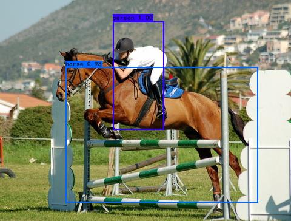

# yoloV4  
General object detection  
 
## Dependencies
+ pyTorch (1.4.0+)
+ python (3.5.0+)
+ cuda-toolkit(9.0+)
+ torchvision (0.2.0+)
+ tensorboard (1.6.0)

## Networks
CSPdarknet-53+Mish++SPP+Head

## Acknowledgement
This work is mainly inspired by  
paper: [YOLO V4：Optimal Speed and Accuracy of Object Detection](https://arxiv.org/abs/2004.10934)  
projects: [darknet](https://github.com/AlexeyAB/darknet),[ssd.pytorch](https://github.com/amdegroot/ssd.pytorch),[pytorch-YOLOv4](https://github.com/Tianxiaomo/pytorch-YOLOv4), 
and [yolov4-pytorch](https://github.com/bubbliiiing/yolov4-pytorch)